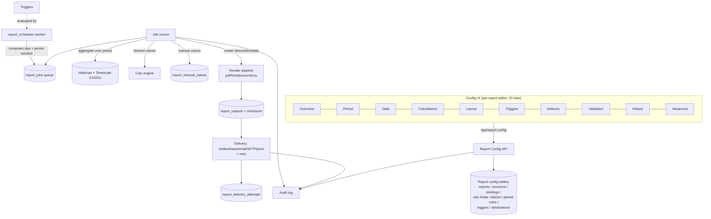
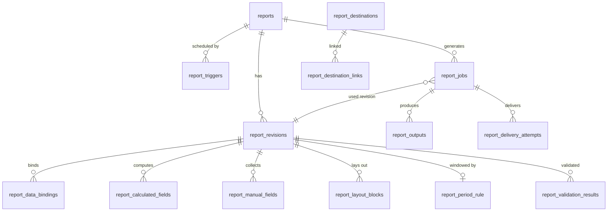
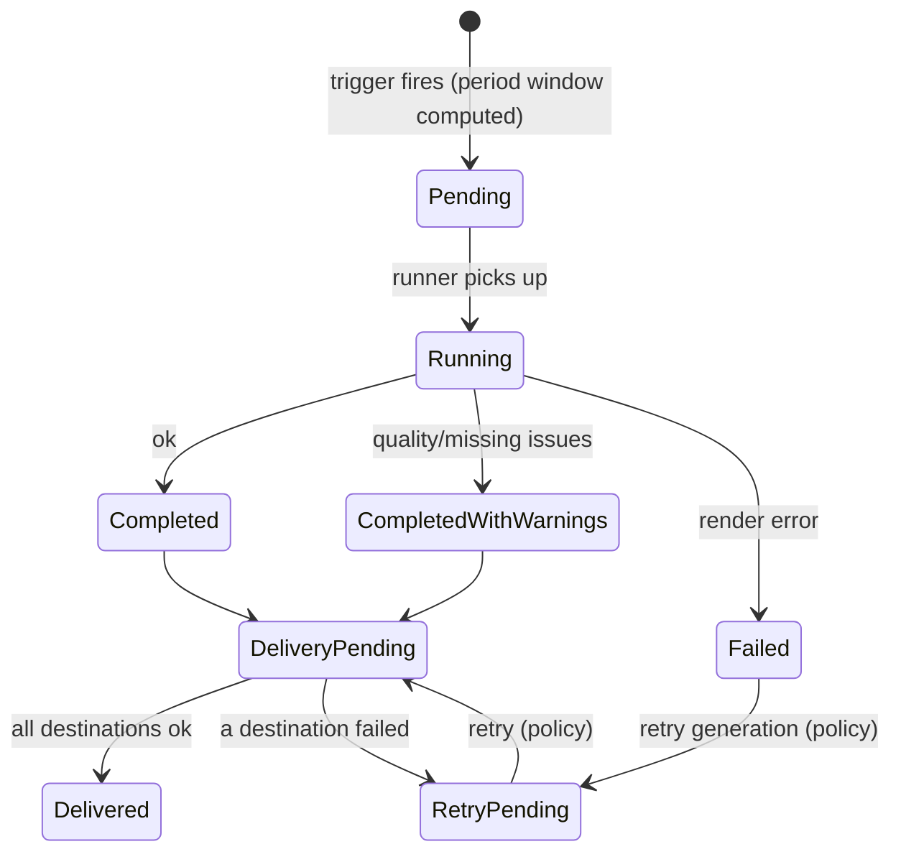

# InduVista — Report Configuration: Gap Analysis & Target Architecture

Companion to *Reports Configuration Module — Detailed Tool Specification*.
This document grounds that spec against the **actual codebase** (verified at
HEAD `1b83884`, June 2026) and proposes a target architecture and migration
path.

**Status legend:** `[V]` verified in code · `[P]` proposed · `[D]` needs a
decision before building.

---

## 1. Executive summary

The spec describes a full, custody-transfer-grade industrial reporting product.
The current module is, in the spec's own terms, a **Phase-1 prototype**. The gap
is large but uneven:

- **Already there (reuse, don't rebuild):** rich triggers (timed/tag, periodic/
  event, catch-up), a JSONB block foundation, multi-format delivery, a quality
  `st` byte convention, historian + TimescaleDB continuous aggregates, a calc-tag
  engine, an audit-log subsystem, RBAC, and store-and-forward reliability.
- **Missing spine (build first):** a **revision/lifecycle** model, a **period =
  data window** concept decoupled from the trigger, and **period aggregation +
  rich data binding**. Without the latter two, outputs are *live-value snapshots*,
  not period reports.
- **Missing surface (build later):** validation engine, stateful job model,
  manual entry, regeneration, approval workflow, preview/test modes.

Recommendation: **evolve, do not rewrite.** Bank the highest value-per-effort
change first (period + aggregation), then the lifecycle backbone, then the
builder/richness, then regulated features.

---

## 2. Current state (verified)

### 2.1 Data model `[V]`

| Table | Key columns | Notes |
|---|---|---|
| `report_definitions` | name, description, category, report_type, template_html, **template_blocks (JSONB)**, **template_mode**, page_size, orientation, enabled | Edited **in place** — no revision concept |
| `report_triggers` | trigger_type (timed/tag), period, at_minute, at_time_min, day_of_month, month_of_year, day_of_week, days_of_week, interval_minutes, cron_expr, tag_id, tag_edge/op/value/expr, owner_report_id, enabled | **Period (data window) is conflated with schedule (when to run)** |
| `report_trigger_links` | report_id, trigger_id | many-to-many |
| `report_trigger_state` | report_id, trigger_id, last_fired_at, last_seen_value | edge/fire tracking |
| `report_destinations` | name, dest_type (folder/network_drive/printer), target, default_fmts, owner_report_id, enabled | |
| `report_destination_links` | report_id, destination_id, fmt (override set, nullable) | constraint fixed in `0067` |
| `report_tags` | report_id, **tag_id, position** | binding is *just* a tag reference — no function/quality/unit/alias |
| `report_records` | report_id, report_name, category, trigger_id, trigger_kind, snapshot_at, generated_at, fmt, file_path, byte_size, status (ok/error), error | thin history row, **not** a stateful job |

### 2.2 Rendering `[V]`

- Context = **latest values** (`build_live_context` reads `latest_tag_values`).
  **No period aggregation** — an "hourly" report renders the value at fire time,
  not the hour's avg/min/max/total.
- Formats: `pdf` (WeasyPrint), `html`, `json`, `xml`. **No `csv`.**
- Scheduler (`report_scheduler.py`): timed + tag triggers, stale-catch-up guard,
  and (as of this session) multi-format delivery honoring the override/default set.

### 2.3 API `[V]`

`/api/report-config/*`: definitions CRUD, triggers CRUD + link, destinations CRUD
+ link, tags GET/PUT, render. `/api/reports`: shift-summary view.
**Absent:** revisions, validate, activate, duplicate, archive, preview,
test-generate, jobs, regenerate, retry-delivery, download.

### 2.4 Roles `[V]`

`viewer < operator < engineer < admin`. **No `approver`, no `auditor`.**

### 2.5 Reusable assets the spec needs `[V]`

Calc-tag engine (tiers A–E) · historian + Timescale CAGGs (power Trends) ·
quality `st` byte (OPC-DA convention) + heatmap cells · engineering units ·
named sets (enumerations) · groups · audit-log subsystem · store-and-forward
buffer · RBAC middleware.

---

## 3. Gap analysis

| # | Spec area | Current | Gap | Effort | Phase |
|---|---|---|---|---|---|
| 1 | Overview / identity | name, category, type, enabled | report_code, owner/area/equipment, status lifecycle, effective dates | S | B |
| 2 | **Revisions & lifecycle** | none (in-place edit) | draft → validate → activate → immutable active → regenerate | **L** | B |
| 3 | **Period = data window** | merged into trigger; render uses "now" | period rules (prev-completed/current/custom), boundary, late-wait, grace, missing-period handling | **L** | A |
| 4 | **Data binding + aggregation** | tag_id + position; latest value | function (avg/min/max/total/delta/availability%), quality rule, missing/bad action, unit, alias, decimals, group | **L** | A |
| 5 | Calculations in reports | none (calc engine exists separately) | wire calc fields into report bindings | M | C |
| 6 | Layout / block builder | JSONB blocks + renderer + mode | builder UI, more block types (trend/heatmap/event/signature) | M | C |
| 7 | Triggers | timed/tag, periodic/event, days, conditions, catch-up | ~80% there; tidy + decouple from period | S/M | A/B |
| 8 | Delivery | destinations + multi-format | retry policy, email, SFTP, filename pattern, archive-copy | M | C |
| 9 | Validation engine | none | identity/period/data/calc/layout/trigger/delivery/security checks → pass/warn/fail | M | B |
| 10 | Preview / test generation | on-demand render only | sample/latest/historical/bad-quality/missing simulation, watermarked test | M | C |
| 11 | Job model | `report_records` (thin) | stateful `report_jobs` (Pending/Running/Retry/…) + outputs + delivery attempts | M | B |
| 12 | Manual entry | none | manual fields, entry/approval, audit of values | L | D |
| 13 | Regeneration | none | regenerate by revision from historian/replay/external/manual | L | D |
| 14 | Approval workflow + e-sig | none | approver gate, signatures | L | D |
| 15 | Audit & history | audit-log subsystem exists | add report-specific events + config diff | S/M | B |
| 16 | Roles | 4-rung ladder | add `approver`, `auditor`; wire to activate/manual-approve | S | B |
| 17 | Quality indication | `st` byte + heatmap cells | reconcile to report display states (Good/Uncertain/Bad/Missing/Manual/Estimated/Stale) | S | A `[D]` |

*Effort: S = small, M = medium, L = large.*

---

## 4. Target architecture

### 4.1 Principles

1. **Revision is the unit of configuration.** `reports` holds identity + a pointer
   to the active revision; `report_revisions` holds an immutable config snapshot.
2. **Period (what data) is separate from Trigger (when to run).** A trigger creates
   a *job*; the job's period window is computed from the revision's period rule.
3. **Reuse, don't duplicate.** Aggregation rides the historian + CAGGs; calculations
   ride the calc engine; quality rides the `st` byte; audit rides the audit-log
   subsystem; auth rides RBAC.
4. **One quality convention.** Report display states are **derived** from the
   existing `st` byte — never a third independent code scheme.

### 4.2 Component & runtime architecture `[P]`

### 4.3 Target data model `[P]`

Tables marked **NEW** don't exist yet; **EVOLVE** changes an existing table.

| Table | Change | Key columns |
|---|---|---|
| `reports` | EVOLVE from `report_definitions` | id, **report_code (unique)**, name, description, category, report_type, area, equipment, owner_dept, **status** (draft/active/disabled/failed_validation/archived), **active_revision_id**, created/updated meta |
| `report_revisions` | **NEW** | id, report_id, revision_no, label, status, validation_status, change_reason, effective_from/to, template_mode, template_html, page_size, orientation, created meta |
| `report_period_rule` | **NEW** (or columns on revision) | revision_id, period_type, period_rule, start_offset, end_offset, boundary, allow_partial, late_data_wait, grace_period, missing_period_handling, label_format, filename_format |
| `report_data_bindings` | EVOLVE from `report_tags` | id, revision_id, source_type, tag_id, alias, display_name, unit_id, **data_function**, period_window, required, **quality_rule**, **missing_action**, **bad_action**, decimal_places, format, low/high_limit, sort_order, group_name |
| `report_calculated_fields` | **NEW** (or link calc engine) | id, revision_id, name, alias, formula, unit_id, decimals, required_inputs, quality_dependency, missing_action, execution_order |
| `report_manual_fields` | **NEW** | id, revision_id, name, alias, data_type, unit_id, required, default_value, min/max, dropdown_source, entry_role, approval_required, audit_required |
| `report_layout_blocks` | EVOLVE (keep JSONB on revision, typed schema) | block_type, title, visibility, sort_order, page_break, formatting, data_source, display_opts, group_by |
| `report_triggers` | EVOLVE | drop period/window fields (move to period rule); keep schedule + event fields; link to **report** (not revision) |
| `report_jobs` | EVOLVE from `report_records` | id, report_id, revision_id, trigger_type, **period_start_utc, period_end_utc**, due/started/completed_at, status (pending/running/completed/completed_with_warnings/failed/retry_pending/cancelled/regenerated/superseded), warning/error_count, data_quality_summary, generated_by, output_status, checksum |
| `report_outputs` | **NEW** | id, job_id, fmt, file_path, byte_size, checksum, is_test |
| `report_delivery_attempts` | **NEW** | id, job_id, destination_id, attempt_no, status, error, attempted_at |
| `report_validation_results` | **NEW** | id, revision_id, category, level (passed/warning/failed/info), message, field |

### 4.4 Revision lifecycle `[P]`

```mermaid
stateDiagram-v2
  [*] --> Draft: create / edit creates draft
  Draft --> Draft: save
  Draft --> FailedValidation: validate (fail)
  Draft --> Validated: validate (pass / pass+warn)
  FailedValidation --> Draft: fix
  Validated --> Active: activate (approver; warnings need permission)
  Active --> Draft: edit -> new draft revision
  Active --> Disabled: disable
  Disabled --> Active: re-enable
  Active --> Archived: archive (prior active superseded)
  Archived --> [*]
```

Rules: active revisions are **read-only**; editing forks a new draft; only
`Validated` revisions activate; activating archives the prior active and
refreshes the scheduler; every transition is audited.

### 4.5 Job & delivery flow `[P]`

Local archive is written **before** external delivery (so a delivery failure never
loses the report), matching the spec's reliability requirement.

### 4.6 Quality mapping `[D]` — needs sign-off

Do **not** introduce the diagram's standalone codes (Good 0 / Uncertain 1 / Bad 2 /
Missing 3 / Manual 10 / Estimated 11 / Stale 12) as a new stored convention — it
conflicts with the existing `st` byte (OPC-DA) and heatmap cells. **Proposed**
derivation (display only) from existing signals:

| Report display | Derived from |
|---|---|
| Good | `st >= 128` |
| Uncertain | `64 <= st < 128` |
| Bad | `st < 64` |
| Missing | no sample in period window |
| Stale | sample age > configured staleness (per binding) |
| Manual | binding `source_type = manual` |
| Estimated | binding `missing_action = estimate` produced the value |

The numeric codes in the diagram can be a pure **display lookup** layered on top —
they must not become a parallel source of truth. Confirm this mapping (or supply
the authoritative rules) and record it in `PROJECT_KNOWLEDGE.md`.

### 4.7 API surface additions `[P]`

Keep `/api/report-config/*`; add (mirroring the spec §22):
`POST /reports/{id}/duplicate`, `POST /reports/{id}/archive`,
`GET|POST /reports/{id}/revisions`, `POST /report-revisions/{id}/activate`,
`POST /report-revisions/{id}/validate`, `GET|PUT /report-revisions/{id}/data-bindings`,
`POST /report-revisions/{id}/preview`, `POST /report-revisions/{id}/test-generate`,
`GET /report-jobs`, `POST /reports/{id}/generate`, `POST /reports/{id}/regenerate`,
`POST /report-jobs/{id}/retry-delivery`, `GET /report-jobs/{id}/download`.

### 4.8 Deliberate simplifications for this deployment `[P]`

Solo dev, single plant — build the data model to *allow* these later, but don't
implement now: external job-queue infra (Redis+RQ/Celery) → a stateful
`report_jobs` table driven by the existing worker is sufficient; multi-node HA;
electronic signatures. These are Phase-D/optional.

---

## 5. Migration path (current → target)

1. **Rename/evolve, don't drop.** `report_definitions` → `reports` + first
   `report_revisions` row (revision_no 1) holding the existing template/blocks/
   page settings. Back-fill `active_revision_id`.
2. `report_tags` → `report_data_bindings` (existing rows become bindings with
   `data_function = 'latest'`, `quality_rule = 'all'` — preserving today's behavior).
3. `report_records` → `report_jobs` (+ `report_outputs`): migrate history rows as
   completed jobs; new outputs table going forward.
4. Move period/window fields off `report_triggers` into `report_period_rule`
   (triggers keep schedule/event fields only).
5. Add `approver`, `auditor` to the role ladder; wire `activate` and manual-approve
   to `approver`.
6. Each step is its own Alembic migration with a tested downgrade; no destructive
   drops until the new path is proven (TRUNCATE/known-data only per project rules).

---

## 6. Recommended phasing

| Phase | Goal | Contents |
|---|---|---|
| **A — make outputs real reports** | highest value/effort | period = data window (#3); data binding + period aggregation (#4); quality-display mapping (#17); reuse CAGGs |
| **B — lifecycle backbone** | unlock audit/regeneration cleanly | revisions (#2); validation engine (#9); `report_jobs` (#11); identity fields (#1); approver/auditor (#16); audit events (#15) |
| **C — builder & richness** | engineer-facing power | layout block builder (#6); calculations wired in (#5); preview/test modes (#10); delivery retry + email/SFTP + filename pattern (#8) |
| **D — regulated / enterprise** | compliance | manual entry + approval (#12); regeneration with reason (#13); e-signatures (#14) |

**Quick wins (low effort, visible):** `report_code` + status/owner fields; delivery
filename pattern; a first-pass validate-before-activate; approver/auditor roles.

---

## 7. Open decisions before building

1. **Quality mapping (§4.6)** — confirm the proposed derivation or supply the rules. *(blocks Phase A)*
2. **Revision granularity** — config-snapshot per revision (recommended) vs delta-based.
3. **Job execution** — stateful table + existing worker (recommended) vs external queue.
4. **Calculations** — reuse the existing calc-tag engine inside reports vs a report-local formula evaluator.
5. **Manual entry storage** — per-job values vs per-period values (affects regeneration semantics).

---

*Compatibility note:* the spec's 10 tabs are the **per-report editor** tabs
(replacing today's Content/Tags/Triggers/Destinations/Settings). The recently
shipped top-level **Definitions / Triggers / Destinations** consolidation is a
different (library) level and remains compatible.
